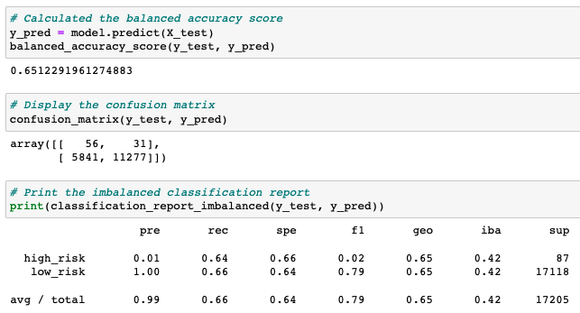

# Credit_Risk_Analysis
## Overview
### Purpose
After building on skills in data preparation, statistical reasoning, and machine learning, I was next tasked with applying machine learning to solve a real-world challenge: credit card risk. To try and overcome the inherently unbalanced classification problem due to higher numbers of good loans over risky loans, I employed different techniques to train and evaluate models with the unbalanced classes through the use of imbalanced-learn and scikit-learn libraries.

Using the credit card credit dataset from LendingClub, a peer-to-peer lending services company, I oversampled the data using the RandomOverSampler and SMOTE algorithms, and undersampled the data using the ClusterCentroids algorithm. Next, I used a combinatorial approach of over- and undersampling using the SMOTEENN algorithm. Finally, I compared two new machine learning models that reduce bias, BalancedRandomForestClassifier and EasyEnsembleClassifier, to predict credit risk.

## Results

### RandomOverSampler (Oversampling)

- Balanced Accuracy Score: 65.3%
- High Risk:
    - Precision: 0.01
    - Recall: 0.64
    - F1Score: 0.02
- Low Risk:
    - Precision: 1.00
    - Recall: 0.67
    - F1Score: 0.80

### SMOTE (Oversampling)

- Balanced Accuracy Score: 65.1%
- High Risk:
    - Precision: 0.01
    - Recall: 0.64
    - F1Score: 0.02
- Low Risk:
    - Precision: 1.00
    - Recall: 0.66
    - F1Score: 0.79

### ClusterCentroids (Undersampling)

- Balanced Accuracy Score: 51.0%
- High Risk:
    - Precision: 0.01
    - Recall: 0.59
    - F1Score: 0.01
- Low Risk:
    - Precision: 1.00
    - Recall: 0.43
    - F1Score: 0.60

### SMOTEENN (Over+Undersampling)

- Balanced Accuracy Score: 62.3%
- High Risk:
    - Precision: 0.01
    - Recall: 0.70
    - F1Score: 0.02
- Low Risk:
    - Precision: 1.00
    - Recall: 0.54
    - F1Score: 0.70

### BalancedRandomForestClassifier

- Balanced Accuracy Score: 78.8%
- High Risk:
    - Precision: 0.04
    - Recall: 0.67
    - F1Score: 0.07
- Low Risk:
    - Precision: 1.00
    - Recall: 0.91
    - F1Score: 0.95

### EasyEnsembleClassifier

- Balanced Accuracy Score: 92.5%
- High Risk:
    - Precision: 0.07
    - Recall: 0.91
    - F1Score: 0.14
- Low Risk:
    - Precision: 1.00
    - Recall: 0.94
    - F1Score: 0.97

## Summary
After training and testing our credit card risk data using a number of different techniques, one thing we can definitively say is it is hard to predict credit card risk with precision. All of the models struggled in that regard, with the highest precision score being 0.07, meaning the model incorrectly designated a loan as "high-risk", that was instead low-risk, 93% of the time. When it came to recall and sensitivity, there was a wider range of outcomes, with the lowest recall score being 0.59 and the highest being 0.91. In this regard, the EasyEnsemble AdaBoost model was the most sensitive, correctly capturing 91% of the high-risk loans. If the bank using one of these models would be open to a high false positive rate, meaning low-risk loans were being flagged as high-risk, for the tradeoff of capturing over 90% of the high-risk loans, then I would recommend the EasyEnsemble AdaBoost model. However, it is far from the ideal predictive model, and its 0.14 F1 score gives me pause in recommending it at all, even with its 92.5% accuracy score.
